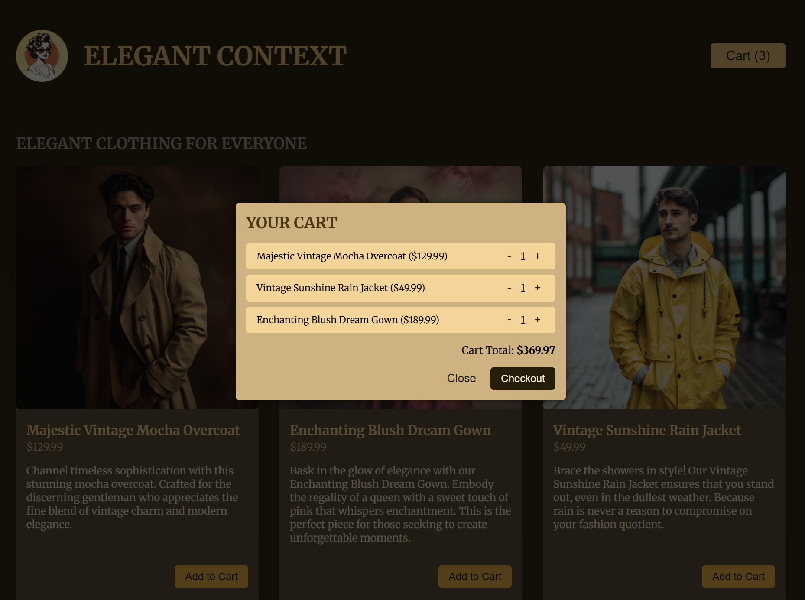

# Shop Cart

A modern, responsive shopping cart application built with React and Vite. Features a clean UI with product browsing, cart management, and real-time price calculations.

---

## 🚀 Live Demo

👉 https://react-shop-cart-navy.vercel.app/

## 📸 Screenshots

### Homepage


_Main interface of the Shop Cart showing the product browse page with elegant clothing items and shopping cart functionality._

### Cart


_Shopping cart modal displaying added items, quantities, and total price calculation._

---

## Features

- 🛍️ **Product Display** - Browse a collection of elegant clothing items
- 🛒 **Shopping Cart** - Add and remove items from your cart
- 📊 **Quantity Management** - Increase/decrease item quantities with real-time updates
- 💰 **Price Calculation** - Automatic total price calculation with proper formatting
- 🎨 **Modal Cart** - View cart items in an elegant modal interface
- 📱 **Responsive Design** - Works seamlessly on desktop and mobile devices
- ⚡ **Context API** - Centralized state management using React Context and useReducer

## Tech Stack

- **React** - Frontend framework
- **Vite** - Lightning-fast build tool and dev server
- **React Context API** - State management
- **CSS** - Styling for responsive UI
- **ESLint** - Code quality and consistency

## Getting Started

### Prerequisites

- Node.js (v14 or higher)
- npm or yarn package manager

### Installation

1. Clone the repository:

```bash
git clone https://github.com/vasylpryimakdev/react-shop-cart.git
cd shop-cart
```

2. Install dependencies:

```bash
npm install
```

3. Start the development server:

```bash
npm run dev
```

The application will be available at `http://localhost:5173` (or the port shown in your terminal).

## Available Scripts

- `npm run dev` - Start the development server with hot module replacement
- `npm run build` - Build the project for production
- `npm run preview` - Preview the production build locally
- `npm run lint` - Run ESLint to check code quality

## Project Structure

```
shop-cart/
├── src/
│   ├── components/
│   │   ├── Cart.jsx              # Cart display component
│   │   ├── CartModal.jsx         # Modal wrapper for cart
│   │   ├── Header.jsx            # Header with cart button
│   │   ├── Product.jsx           # Individual product item
│   │   └── Shop.jsx              # Products container
│   ├── store/
│   │   └── shopping-cart-context.jsx  # Context and reducer logic
│   ├── App.jsx                   # Main application component
│   ├── main.jsx                  # React DOM entry point
│   ├── index.css                 # Global styles
│   └── dummy-products.js         # Sample product data
├── public/                       # Static assets
├── index.html                    # HTML template
├── vite.config.js                # Vite configuration
└── package.json                  # Project dependencies
```

## How It Works

### Context & State Management

The application uses React's Context API with `useReducer` for centralized state management:

- **CartContext** - Provides cart state and actions to all components
- **shoppingCartReducer** - Handles cart state updates (ADD_ITEM, UPDATE_QUANTITY)

### Key Components

1. **Header** - Displays the header with a button to open the cart modal
2. **Shop** - Container for displaying all available products
3. **Product** - Individual product item with add-to-cart functionality
4. **Cart** - Shows cart items, quantities, and total price
5. **CartModal** - Modal overlay for displaying the shopping cart

## Usage

1. **Browse Products** - View available clothing items in the shop
2. **Add to Cart** - Click "Add to Cart" button on any product
3. **View Cart** - Click the cart icon in the header to view items
4. **Adjust Quantities** - Increase or decrease item quantities in the cart
5. **Remove Items** - Click the remove button to delete items from cart
6. **See Total** - View the automatically calculated total price

## Contributing

This is a personal project. Feel free to fork and enhance it!

## License

This project is open source and available under the MIT License.

## Key Concepts

This project implements:

- React Context API and useContext hook
- useReducer for complex state management
- Component composition and modular design
- Event handling and state updates in React
- Real-time calculations and UI updates
- Modal-based user interface patterns

---

**Note:** This project uses dummy product data. To connect a real backend, replace the dummy data source with API calls.
